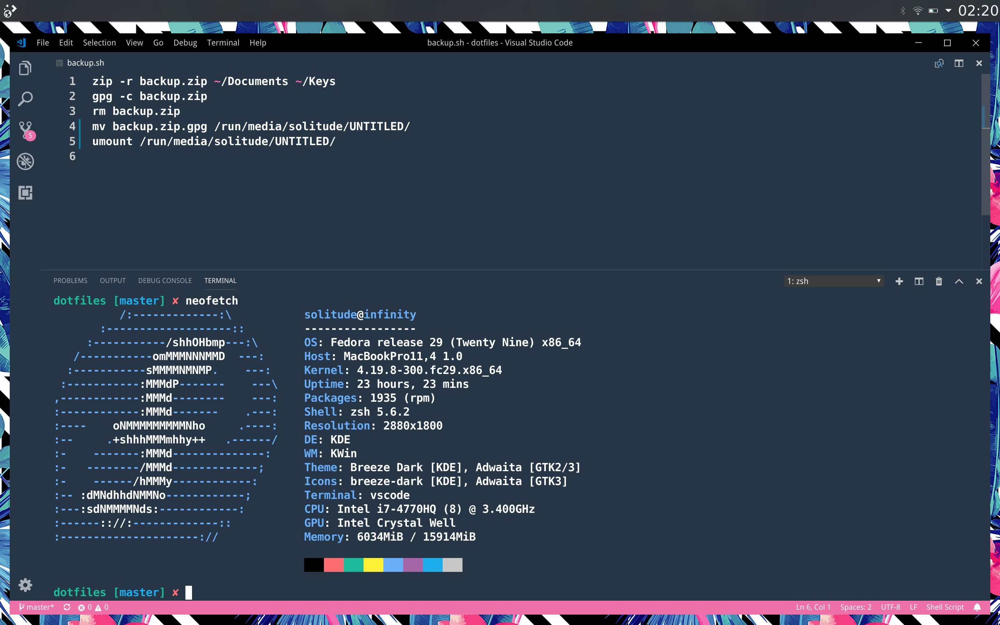

# Dotfiles

Personal dotfiles, scripts and guides



## Installation

Go through system settings, remove packages and restore backup files

```sh
sudo apt update && sudo apt upgrade && sudo apt dist-upgrade && sudo apt autoremove
sudo apt install curl zsh neovim git gpg keepassxc firefox thunderbird spotify docker libreoffice vlc ssh wget htop

chsh -s /usr/local/bin/zsh
zsh
sh -c "$(curl -fsSL https://raw.githubusercontent.com/robbyrussell/oh-my-zsh/master/tools/install.sh)"

ln -s ~/Keys/ssh ~/.ssh
ssh-add ~/.ssh/ole.blaesing@web.de

mkdir ~/Repositories
~/Repositories
git clone https://github.com/oleblaesing/dotfiles.git

ln -sf ~/Repositories/dotfiles/zsh/.zshrc ~/.zshrc
ln -s ~/Repositories/dotfiles/zsh/themes/macos.zsh-theme ~/.oh-my-zsh/themes/macos.zsh-theme
ln -s ~/Repositories/dotfiles/git/.gitconfig ~/.gitconfig
mkdir -p ~/.config/nvim
ln -s ~/Repositories/dotfiles/nvim/init.vim ~/.config/nvim/init.vim
ln -sf ~/Repositories/dotfiles/vscode/settings.json ~/.config/Code/User/settings.json
ln -sf ~/Repositories/dotfiles/vscode/keybindings.json ~/.config/User/keybindings.json

source ~/.zshrc

curl -fLo ~/.local/share/nvim/site/autoload/plug.vim --create-dirs https://raw.githubusercontent.com/junegunn/vim-plug/master/plug.vim
nvim +PlugInstall

mkdir .themes
cd .themes
wget https://www.gnome-look.org/p/1099856/startdownload?file_id=1559925485&file_name=Ant-Dracula.tar&file_type=application/x-xz&file_size=367844
tar -xf Ant-Dracula.tar
gsettings set org.gnome.desktop.interface gtk-theme Ant-Dracula
gsettings set org.gnome.desktop.wm.preferences theme Ant-Dracula
```
